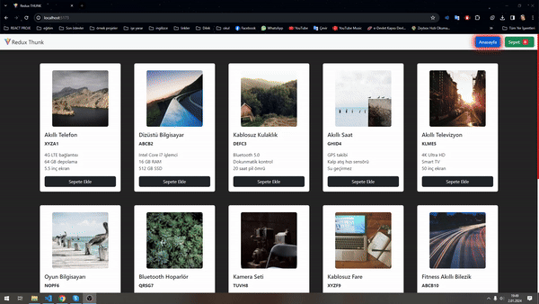

# React + Vite + Redux + Thunk
# React Redux Sepet Uygulaması

Bu proje, React ve Redux kullanılarak geliştirilmiş basit bir alışveriş sepeti uygulamasını içerir. Redux Thunk middleware'i kullanılarak asenkron işlemler gerçekleştirilmiştir.

### Ekran Görüntüsü

## Kullanılan Teknolojiler

- React
- Redux
- Redux Thunk
- Axios
- Tailwind CSS

## Özellikler

- Sepete ürün ekleme
- Sepetten ürün çıkarma
- Sepet içindeki ürünleri güncelleme
- Toplam fiyatı hesaplama

